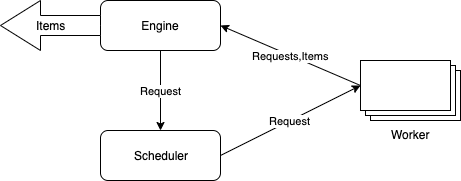
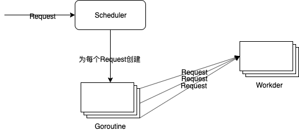

---
---

# 爬取珍爱网征婚信息

库依赖

名称 | 描述
-|-
golang.org/x/text | 字符集编码转换
golang.org/x/net/html | 网页字符集自动发现
gopkg.in/olivere/elastic.v5 | elastic客户端

## 总体算法

# 单任务版

## 获取城市名称和链接
- 使用css选择器
- 使用xpath
- 使用正则表达式

## Parser解析器
- 输入：UTF-8编码的文本
- 输出：Request{URL, 对应Parser}列表，Item列表

## 架构图

# 并发版
## 架构图

## Scheduler实现一：所有Worker公用一个输入

缺点：
- 存在循环等待的问题

## Scheduler实现二：并行分发Request

